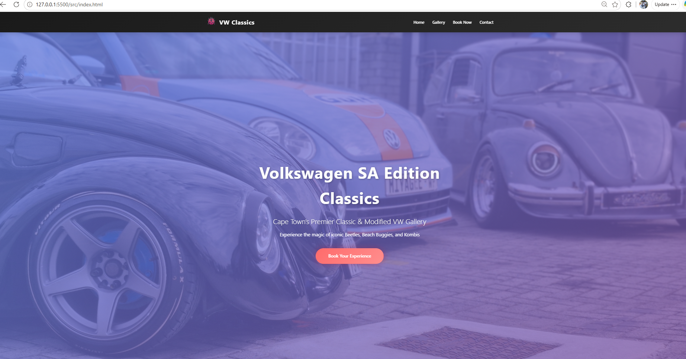
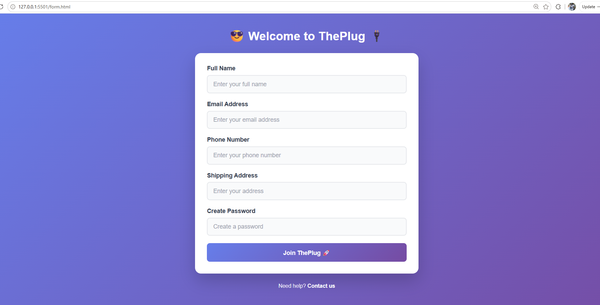

# Personal Portfolio Website

## Overview

This project is a responsive personal portfolio website built with HTML and CSS. It introduces the developer, summarizes skills, presents sample projects, and provides a contact form for potential collaborators or employers. The site is organized into four pages: Home, About Me, Projects, and Contact.

## Issues Found

The starter code contained several errors and omissions:

- The About, Projects, and Contact pages did not include the main navigation, making the site difficult to explore.
- The Projects page used `Screenshots/` with a capital `S`, while the actual folder is `screenshots/`. This can break image loading on case-sensitive systems.
- The third project referenced `images/project3.jpg`, but that asset was not available in the images folder.
- The Projects page had an extra `>` after the closing footer tag.
- The home-page hero image declared very small dimensions (`30` by `50`), which could distort its intrinsic display size.
- Starter markup used inconsistent indentation and lacked some page-level descriptions.

## Fixes Implemented

The current implementation adds descriptive metadata where needed, meaningful image alternative text, explicit image dimensions, structured headings, a labeled contact form, and responsive image sizing. The stylesheet also supplies visible hover and keyboard-focus states, mobile navigation behavior, validation feedback, consistent spacing, and reusable layout styles. The available project screenshot asset is now included in the repository for the Projects page.

## HTML Structure and Semantics

Each page uses `header`, `nav` where provided, `main`, `section`, and `footer` landmarks. Headings follow a logical hierarchy, with one page title and nested section headings. The About page uses a captioned table with column scopes for skills. The Contact page uses a `form` with associated `label` elements, semantic input types, autocomplete hints, required fields, and a submit button. Images include descriptive `alt` text and dimensions.

## CSS Approach

`portfolio/css/styles.css` begins with global box sizing and base typography, then defines reusable selectors for the header, navigation, main content, sections, projects, tables, images, forms, links, and footer. Class selectors such as `.hero`, `.intro`, `.work`, `.project`, and `.footer` provide page-specific styling, while element selectors such as `nav a`, `form input`, and `table` keep repeated patterns consistent. Pseudo-classes (`:hover`, `:focus`, `:focus-visible`, `:valid`, and `:invalid`) communicate interaction and form state. A media query at `max-width: 600px` adapts navigation, spacing, typography, and table padding for smaller screens.

## Accessibility Improvements

The site includes the document language, viewport metadata, descriptive page titles, navigation labeling, current-page indication on the Home link, meaningful image alternatives, table headers with scopes, explicit form labels, required-field and email validation, autocomplete attributes, and high-visibility keyboard focus outlines.

## View Locally

Open `portfolio/index.html` directly in a browser, then use the page links to navigate. For a local server, run this from the repository root:

```text
python -m http.server 8000
```

Visit `http://localhost:8000/portfolio/`.

## Screenshots






## Reflection

The most challenging part was separating visual problems from path and markup errors. A path that worked on Windows could still fail after deployment because folder names are case-sensitive elsewhere. I compared every referenced asset with the actual folders, checked the HTML structure around the broken footer, and reviewed the CSS selectors against the classes used in each page. Testing at a narrow viewport also exposed where the navigation and content needed responsive rules. Using semantic elements, explicit labels, and focus states resolved both usability and accessibility issues without adding JavaScript or unnecessary dependencies.
